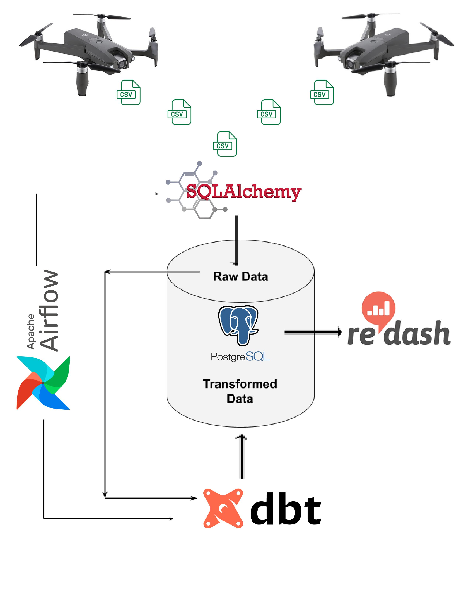

# Building a Scalable Data Warehouse for AI-Driven Traffic Analytics

## Project Overview

Welcome to our AI startup's ambitious project aimed at transforming the way traffic data is analyzed and utilized for smart city initiatives. This README will guide you through the project structure, business need, data source, and instructions for setting up the data warehouse tech stack using Airflow, dbt, PostgreSQL, and Redash.

[Read the Blog for details](https://medium.com/@natnaelbekele142/data-warehousing-the-engine-of-business-intelligence-2dac8adeb921)

### Project Structure

- **/dags:** Airflow DAG scripts for orchestrating data loading and transformation.
- **/dwh_dbt:** dbt project folder containing models for data transformation.
- **/notebooks:** Jupyter notebook files for raw CSV data processing and loading.
- **/data:** Raw CSV files used in the project.
- **/images:** Images used in the README.
- **/redash:** Redash project folder for visualization and reporting.
- **/test:** Contains test scripts.
- **.gitignore:** Git configuration to exclude unnecessary files.
- **docker-compose.yaml:** Docker Compose configuration for fully dockerized deployment.

### Business Need

Our AI startup collaborates with businesses to deploy sensors, collecting diverse data for critical intelligence. The city traffic department has entrusted us to create a scalable data warehouse that analyzes vehicle trajectory data from swarm UAVs, aiming to enhance traffic flow and contribute to undisclosed projects.

### Data Source

We utilize the pNEUMA dataset, a large-scale collection of naturalistic vehicle trajectories in Athens, Greece. This dataset, acquired by a unique experiment using swarm drones, provides valuable insights into traffic patterns.

**Data Source:** [pNEUMA Dataset](https://zenodo.org/records/7426506)

**References for Understanding Data Generation:**
- [PIA15_poster.pdf](datafromsky.com)
- [Automatic vehicle trajectory extraction for traffic analysis from aerial video data](researchgate.net)

**Visualization and Interaction Tools:**
- [travia: Traffic data Visualization and Annotation tool](github.com/tud-hri/travia)
- [pNEUMA_mastersproject: Python files to work with pNEUMA dataset](github.com/JoachimLandtmeters/pNEUMA_mastersproject)

## Instructions

### Setting Up Locally

1. **Fully Dockerized Deployment:**
   - Ensure Docker is installed on your machine.
   - Run `docker-compose up` in the project root to deploy PostgreSQL, Airflow, dbt, and Redash.

2. **DAG Setup in Airflow:**
   - Create a DAG in Airflow for loading data files into the database.
   - Implement separation for Production, Development, and Staging environments.

3. **Connect dbt with Data Warehouse:**
   - Write transformation code in dbt to execute via Airflow's Bash or Python operator.
   - Document data models thoroughly and present them using the dbt docs UI.

4. **Data Quality Monitoring:**
   - Explore additional dbt modules for data quality monitoring (e.g., great_expectations, dbt_expectations, or re-data).

5. **Connect Reporting Environment - Redash:**
   - Connect Redash to the data warehouse.
   - Create a dashboard showcasing insights derived from the data.

6. **Documentation and Article:**
   - Write comprehensive documentation for the project, including setup steps and data model details.
   - Craft a short article describing your approach and key decisions made throughout the project.

## Conclusion

This project aligns with our mission to revolutionize traffic analytics, providing cities with actionable insights for smart urban planning. We invite you to explore, contribute, and leverage our data warehouse solution to make impactful decisions for a more connected and efficient future.

[Read my Blog for in-depth explanation🔗](https://medium.com/@natnaelbekele142/data-warehousing-the-engine-of-business-intelligence-2dac8adeb921)

